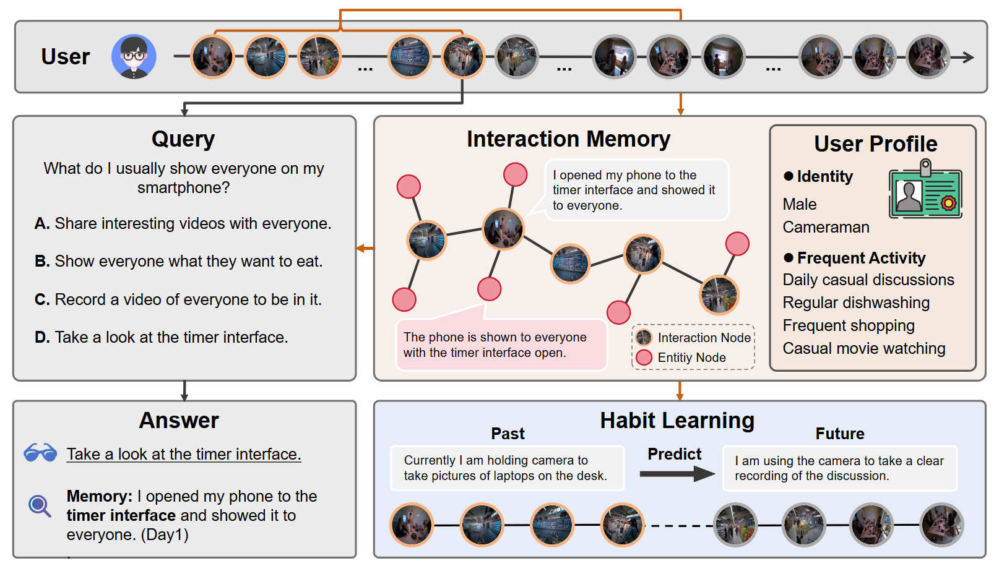

<div align="center">

# EgoSelf: From Memory to Personalized Egocentric Systems



</div>

---

This repository accompanies the paper **"EgoSelf: From Memory to Personalized
Egocentric Systems"**. It packages two cooperating modules that together turn
raw egocentric video into a queryable, personalized memory:

- **`memory/`** — auto-annotation pipeline on each video clip
  (ASR, captioning, object tracking, voiceprint, event-relation reasoning),
  maintaining a cross-clip global memory of speakers, objects, and events.
- **`event_graph/`** — converts `memory/` event JSONs into a Neo4j graph,
  computes embeddings, clusters events, and runs retrieval-based evaluations.

---

## Overview

```
egoself/
├── memory/             # video → event JSON pipeline
│   ├── scripts/        # run_video_dir.py, run_single_video.py
│   ├── src/            # asr, caption, entity, voiceprint, relation
│   ├── configs/        # config.yaml
│   └── submodules/     # Grounded-SAM-2, whisperX, pyannote-audio
├── event_graph/        # event JSON → Neo4j graph
│   ├── event_graph/    # build event graph 
│   ├── configs/        # config.yaml
│   └── scripts/        # event graph scripts
├── requirements/       # install requirements
├── setup.sh            # env install
└── README.md           # this file
```

---

## Environment Setup

```bash
cd egoself
bash setup.sh
```

### API keys

API Placeholder strings that you replace with your own credentials:

| Placeholder | Provider | Used for |
|---|---|---|
| `YOUR_OPENAI_API_KEY_HERE` | OpenAI (direct) | Whisper / GPT-4o transcription in `memory/`, LLM query intent in `event_graph/` |
| `YOUR_GEMINI_API_KEY_HERE` | Google AI Studio | Gemini text embeddings in `event_graph/` |

Files to edit (do a find-and-replace for each placeholder):

- `memory/configs/config.yaml` — main memory pipeline config
- `event_graph/configs/config.yaml` — embedding + LLM keys for the graph module

---

## Usage

### Memory

**1. Single video**
```bash
python memory/scripts/run_single_video.py \
  --video_path /path/to/clip.mp4 \
  --config memory/configs/config.yaml
```

**2. Batch over a directory**
```bash
python memory/scripts/run_video_dir.py \
  --video_dir /path/to/videos \
  --config memory/configs/config.yaml \
  --start_idx 0 --num_videos 10
```

See `memory/README.md` for detailed instructions.

### Event Graph

**1. Initialize Neo4j schema** *(once)*
```bash
python event_graph/scripts/initialize_neo4j.py
```

**2. Build graph from memory event JSONs**
```bash
python event_graph/scripts/build_graph_from_json.py \
  --input memory/data/events/DAY1
```

See `event_graph/README.md` for detailed instructions.


---

## Citation

If you find this work useful, please consider citing:

```bibtex
@misc{wang2026egoself,
      title={EgoSelf: From Memory to Personalized Egocentric Assistant},
      author={Wang, Yanshuo and Xu, Yuan and Li, Xuesong and Hong, Jie and Wang, Yizhou and Chen, Chang Wen and Zhu, Wentao},
      year={2026},
      eprint={2604.19564},
      archivePrefix={arXiv},
      primaryClass={cs.CV},
      url={https://arxiv.org/abs/2604.19564},
}
```
